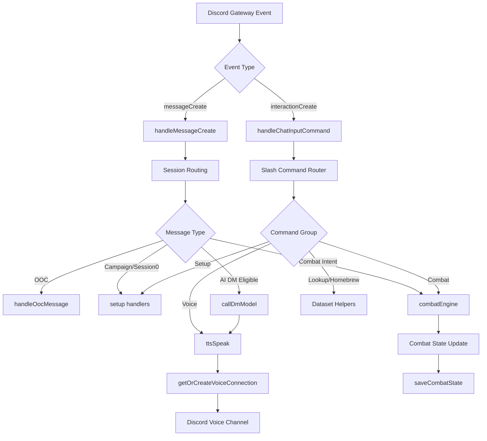

# Runtime Flow (Discord Bot)

This document summarizes the current runtime flow from Discord events to commands,
combat, AI DM responses, and voice/TTS.

## Notes

- Session IDs are derived per channel/thread in `src/session/helpers.js`.
- Session state maps live in `src/session/state.js`.
- The AI DM call is implemented in `src/dm/model.js`.
- TTS uses `src/voice/tts.js` and `src/voice/connection.js`.

## File Map (Nodes to Code)

- Discord event wiring: `index.js`
- messageCreate handler: `src/commands/messageHandlers.js`
- interactionCreate handler: `src/commands/handlers.js`
- Slash command definitions: `src/commands/definitions.js`
- Combat engine: `src/combat/engine.js`
- Data store / character bank: `src/data/store.js`
- Voice connection + TTS: `src/voice/connection.js`, `src/voice/tts.js`
